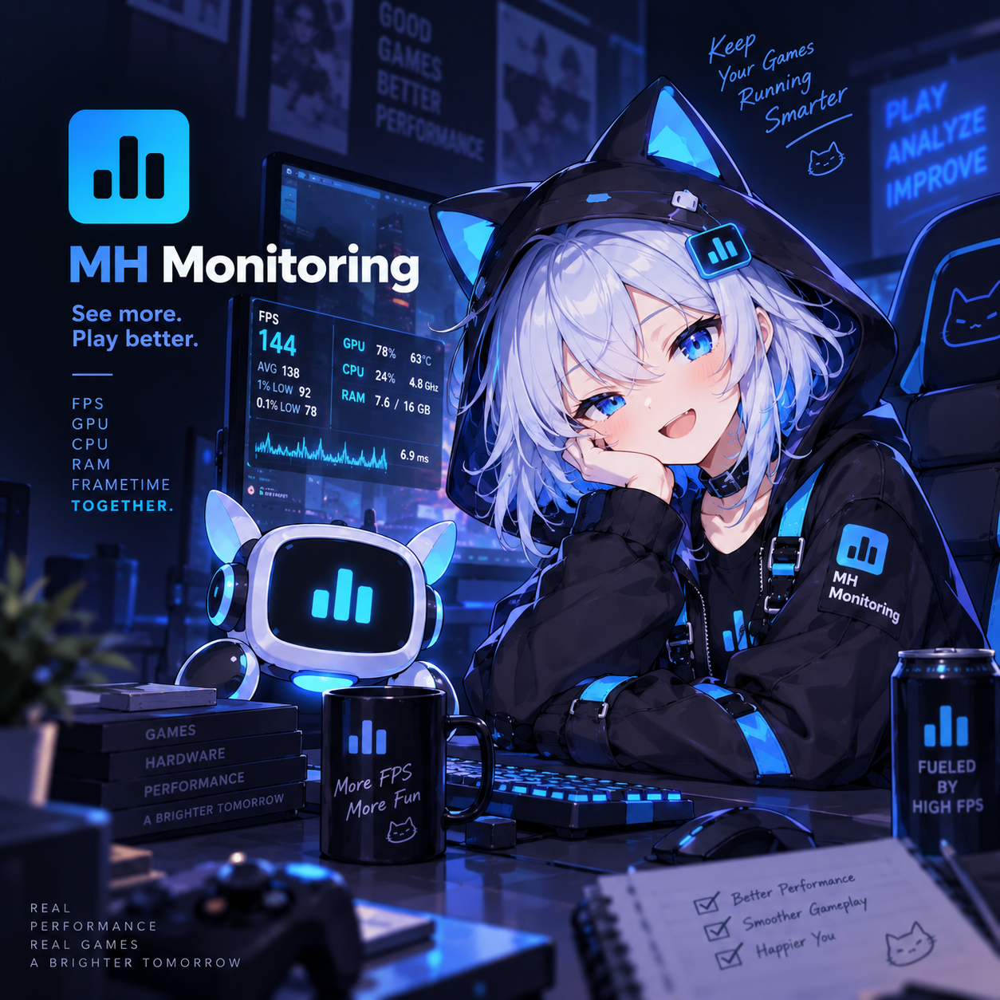
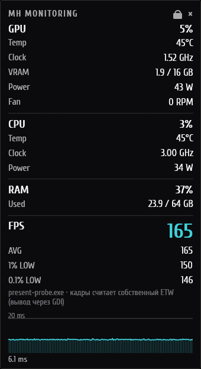

# MH Monitoring

<p align="center">
  
</p>

[](LICENSE)



Компактный оверлей производительности для Windows 10/11. Поверх игры показывает FPS,
frametime-график, 1 % и 0.1 % низкие, а также состояние GPU, CPU и RAM.

Программа распространяется одним нативным исполняемым файлом на Rust. Она не внедряет DLL и не ставит хуки в игры:
кадры считаются через ETW и Intel PresentMon, показания железа берутся из вендорских API.
Поэтому античиты и антивирусы не должны на неё реагировать.

Программа бесплатная, код полностью открыт под лицензией MIT.

## Возможности

- **FPS и кадры:** средний FPS, 1 % и 0.1 % низкие, график frametime с фиксированным окном по
  времени. Цель выбирается автоматически по окну в фокусе или вручную по имени процесса или PID.
  Если у игры идут кадры, Alt+Tab в браузер или редактор цель не меняет: её перехватывает только
  программа, которая сама рисует.
- **GPU:** загрузка, температура, частоты ядра и памяти, VRAM, обороты вентилятора — у любой
  видеокарты. У NVIDIA данные берутся из NVML и дополнительно показывается потребление в ваттах.
  У AMD и Intel — из ядра графики Windows, тех же источников, что у диспетчера задач. Прав
  администратора не нужно.
- **CPU:** загрузка и реальная текущая частота с учётом буста (через PDH, как в диспетчере
  задач), по желанию — загрузка и частота каждого ядра, у гибридных Intel — средние частоты P- и
  E-ядер. Температура и мощность — у AMD Zen 1–5 и у Intel с цифровым датчиком, через драйвер
  [PawnIO](https://pawnio.eu).
- **RAM:** занятая и общая память, память игры (как в колонке «Память» диспетчера задач) и
  рабочая частота модулей из SMBIOS.
- **FPS:** кроме средних и 1 %/0.1 % low — задержка вывода (как «Display Latency» у PresentMon),
  графический API и разрешение окна игры.
- **Честные состояния.** Если источника нет, HUD пишет, какого именно и почему, а не просто
  ставит прочерк.
- **Оверлей:** всегда поверх окон, в том числе поверх игр в безрамочном полноэкранном режиме.
  Позиция сохраняется, окно можно перетаскивать или закрепить в углу выбранного монитора. В
  заблокированном режиме клики проходят сквозь HUD. Прозрачность применяется только к фону,
  текст остаётся чётким. Два вида: столбец блоков или одна полоса («Строка»); по желанию —
  часы и режим «Только игра», в котором HUD виден, только пока в фокусе игра.
- **Трей и горячие клавиши:** показать или скрыть оверлей, заблокировать его, открыть
  настройки, выйти.
- **Окно настроек:** разделы по блокам (видеокарта, процессор, ОЗУ, FPS) с живым
  предпросмотром HUD; изменения применяются кнопкой «Применить». У каждого блока — свои
  строки, название, цвета и пороги предупреждений; общие параметры — порядок блоков, масштаб,
  ширина, единицы измерения, интервал обновления, выбор видеокарты, расположение. Там же
  запуск старых игр в окне без рамки, выбор цели, свой PresentMon, горячие клавиши, служба,
  установка и автозапуск. Настройки можно сохранить в файл и загрузить из него.

## Требования

- Windows 10 или 11, x64.
- Для показаний GPU нужен драйвер видеокарты. Температура и вентилятор у AMD и Intel
  показываются, если драйвер их сообщает (WDDM 2.4 и новее — как в диспетчере задач).
- Для температуры и мощности CPU нужен установленный драйвер [PawnIO](https://pawnio.eu) и
  процессор AMD Ryzen/EPYC (семейства 17h–1Ah) или Intel Core с цифровым датчиком. Поддержка
  Intel проверена только тестами расшифровки регистров: у автора процессор AMD.

## Установка

1. Скачайте `MH-Monitoring.exe` со страницы
   [Releases](https://github.com/midnightheartsgames/MH-Monitoring/releases) или соберите его
   сами (см. ниже).
2. Запустите файл. Откроется окно первого запуска.
3. Выберите, что делать с HUD в эксклюзивном полноэкранном режиме, и один из вариантов:
   - **«Установить (рекомендуется)»** — один запрос UAC, дальше FPS и температура CPU работают
     без прав администратора;
   - **«Только сейчас — от администратора»** — без установки, запрос UAC при каждом запуске;
   - **«Продолжить без FPS»** — без прав: видеокарта, загрузка CPU и память, но без FPS и
     температуры CPU. Установить можно позже в настройках, раздел «Установка».

Установщик делает следующее:

- копирует программу в `C:\Program Files\MH Monitoring`, рядом кладёт
  `MH-Monitoring-Service.exe`;
- регистрирует службу Windows **MH Monitoring** на `MH-Monitoring-Service.exe`. Служба
  захватывает кадры и читает датчики;
- создаёт ярлыки в меню «Пуск» и на рабочем столе;
- добавляет запись в «Программы и компоненты».

После установки сам оверлей работает **без прав администратора**. Если служба остановлена,
оверлей через несколько секунд после старта сам попросит её запустить (запрос UAC). Автозапуск
по умолчанию выключен, его включают флажком в окне первого запуска или в настройках.

Удалить программу можно через «Программы и компоненты» или командой
`MH-Monitoring.exe --uninstall`. Перед удалением программа спросит, удалять ли вместе с ней
настройки и журналы.

Версии до 0.2.0 запускали службу из самого `MH-Monitoring.exe`. После обновления нажмите в
настройках «Обновить установленную»: установщик перерегистрирует службу на новый файл.

Если раньше была установлена версия под старым именем (`MH Monitor`, `mh-monitor.exe`),
установщик уберёт её файлы и ярлык, а включённый автозапуск переведёт на новую копию.

### Без установки

Программу можно запустить и без установки («Только сейчас» или «Без FPS» в окне первого
запуска). Тогда движок работает прямо в процессе оверлея, и для счёта кадров и температуры CPU
её нужно запускать от администратора. Без прав HUD покажет, каких данных не хватает. Когда служба появится, оверлей подключится к ней сам: он проверяет её
каждые 3 секунды.

## Использование

| Действие | Как |
|---|---|
| Показать или скрыть оверлей | `Ctrl+Shift+F11` или меню трея |
| Заблокировать или разблокировать (клики сквозь HUD) | `Ctrl+Shift+F10` или меню трея |
| Переместить оверлей | Разблокировать и перетащить мышью |
| Открыть настройки | Меню трея или `MH-Monitoring.exe --settings` |

Горячие клавиши меняются в настройках и вступают в силу после перезапуска.

### Эксклюзивный полноэкранный режим

Поверх игры в эксклюзивном полноэкранном режиме обычные окна не видны, а перекрытая игра может
перестать рисовать. Поэтому на время этого режима HUD уходит с монитора игры. Куда именно,
выбирается в окне первого запуска или в настройках (раздел «Общие»):

| Режим | Что происходит |
|---|---|
| Скрывать HUD (по умолчанию) | HUD прячется, причина видна в подсказке значка в трее |
| Переносить HUD на другой монитор | HUD переезжает в угол другого монитора (основного, если игра не на нём), после выхода из режима возвращается на место. Без второго монитора HUD прячется |

Чтобы HUD был поверх игры, выберите в ней безрамочный оконный режим.

### Старые игры без безрамочного режима

Для таких игр есть раздел настроек «Игры». Там можно добавить файл игры и указать параметры
запуска. У Warcraft III 1.26 (`Frozen Throne.exe`, `Warcraft III.exe`, `war3.exe`) параметр
`-window` подставляется сам. Если отмечено «Без рамки на весь монитор», MH Monitoring снимает с
окна игры рамку и растягивает его на весь монитор, пока это окно на переднем плане. HUD тогда
виден поверх игры, как в безрамочном режиме.

- Кнопка «Ярлык на рабочем столе» создаёт ярлык `MH-Monitoring.exe --launch "<игра>"`. Он
  запускает игру и оверлей, если тот ещё не запущен.
- В игру ничего не внедряется: меняется только стиль её окна снаружи.
- Рамку снимает только окно нужного файла из папки игры. Редактор карт из той же папки не
  затрагивается.
- Картинка 4:3 на широком мониторе растягивается.
- Окно игры, запущенной от администратора, оверлей без прав изменить не может и пишет об этом
  в HUD.

MH Monitoring не внедряет код в процессы игр, поэтому показать HUD внутри эксклюзивного
полноэкранного режима не может.

## Как это работает

```
┌─── MH-Monitoring-Service.exe (SYSTEM) ─────────┐        ┌─── MH-Monitoring.exe (пользователь) ────────┐
│ PresentMon / собственный ETW → кадры          │        │ HUD на egui, трей, горячие клавиши          │
│ NVML, D3DKMT, PDH, PawnIO    → железо          │◄──────►│ выбор цели по окну в фокусе                 │
│ движок → Snapshot                              │  pipe  │ окно настроек                               │
└────────────────────────────────────────────────┘        └─────────────────────────────────────────────┘
```

- **Кадры.** Основной источник — вложенный Intel PresentMon 2.5.1: он запускается как дочерний
  процесс, а программа читает его CSV. Запасной источник — собственный потребитель ETW-событий
  DXGI/D3D. Для realtime-ETW нужны права, поэтому захватом занимается служба.
- **Выбор цели.** Служба работает в сеансе 0 и не видит окон пользователя. Поэтому игру
  выбирает оверлей и передаёт выбор службе. Если к службе никто не подключён, захват
  останавливается.
- **Связь** идёт через именованный канал `\\.\pipe\MHMonitor` с сообщениями в формате
  «длина + JSON». Доступ к каналу есть только у локальных интерактивных пользователей.
- **Гигиена ETW.** Брошенная realtime-сессия ломает захват кадров на всей машине, в том числе
  у других инструментов. Поэтому у сессий есть общий префикс `MHMonitor-`, а при старте
  программа убирает осиротевшие сессии с этим префиксом.
- **Безопасность службы.** Служба запускает только вложенный PresentMon и только из
  установленной копии в Program Files. Путь к своему PresentMon из настроек пользователя
  служба не использует: иначе это было бы повышением прав.
- **Служба — отдельный файл.** От SYSTEM работает только код, нужный для замера: движок,
  источники, канал. Окна, трей и горячие клавиши (eframe, winit, tray-icon) в процесс службы не
  попадают. У службы 61 крейт в дереве зависимостей, у оверлея 174. Дистрибутив остаётся одним
  файлом: `MH-Monitoring.exe` содержит службу и раскладывает её при установке.

## Цепочка поставок

Код из зависимостей служба выполняет с правами SYSTEM. Поэтому сторонний код попадает в релиз
только проверенным путём (повод —
[атака на `arrayref`](https://blog.rust-lang.org/2026/08/20/supply-chain-attack-on-arrayref/)):

- `Cargo.lock` лежит в репозитории, релиз и CI собираются с `--locked`. Новая версия крейта не
  попадёт в сборку, пока `Cargo.lock` не обновят вручную. После `cargo update` просмотрите
  разницу в `Cargo.lock` и не берите версии, вышедшие последние несколько дней.
- `cargo deny check` ([deny.toml](deny.toml)) проверяет базу RustSec, запрещает отозванные
  версии, git-зависимости и сторонние реестры, сверяет лицензии. CI запускает его на каждый
  коммит и раз в неделю.
- В CI сторонние действия закреплены по SHA коммита, у токена только чтение.
- Релиз собирается скриптом `tools\build-release.ps1`. Рядом с `MH-Monitoring.exe` он кладёт
  `SHA256SUMS.txt`.

## Файлы

| Путь | Назначение |
|---|---|
| `%APPDATA%\MH Monitoring\settings-rs.json` | Настройки |
| `%LOCALAPPDATA%\MH Monitoring\MH-Monitoring.log` | Журнал последнего запуска |
| `%LOCALAPPDATA%\MH Monitoring\bin` | Распакованный PresentMon |

Повреждённый файл настроек переименовывается в `settings-rs.corrupted.json`, и программа
запускается с настройками по умолчанию. Настройки из старой папки `%APPDATA%\MH Monitor`
переносятся автоматически при первом запуске.

## Сборка

Нужен Rust stable с поддержкой edition 2024 (1.85 или новее) и MSVC toolchain.

```powershell
.\tools\build-release.ps1
# результат: target\dist\MH-Monitoring.exe и SHA256SUMS.txt
```

Скрипт сначала собирает службу, затем оверлей со встроенной службой, оба с `--locked`. Обычная
`cargo build --release -p mh-ui` тоже работает, но встраивает службу, только если
`target\release\MH-Monitoring-Service.exe` уже собрана, иначе предупреждает. Такая сборка
может установить службу, только если файл службы лежит рядом с ней.

Готовый `MH-Monitoring.exe` и есть весь дистрибутив: служба, PresentMon, модули PawnIO, шрифты,
иконка и манифест встроены в него.

Проверка зависимостей (нужен `cargo install cargo-deny --locked`):

```powershell
cargo deny check
```

Тесты:

```powershell
cargo test --workspace
```

Замер собственной нагрузки программы (оверлей, служба, PresentMon):

```powershell
.\tools\measure-overhead.ps1 -Seconds 120 -Label "простой"
```

Сравнение чтения видеокарты через NVML и через ядро графики, а также загрузка 3D по процессам:

```powershell
cargo run -p mh-sources --example probe_gpu -- 10
```

### Параметры командной строки

| Параметр | Действие |
|---|---|
| *(без параметров)* | Запустить оверлей |
| `--settings` | Запустить оверлей с открытыми настройками |
| `--launch "<игра>"` | Запустить игру из раздела «Игры» и оверлей |
| `--install` / `--uninstall` | Установить или удалить программу (запрашивает UAC) |
| `--install-service` / `--uninstall-service` | Зарегистрировать службу на `MH-Monitoring-Service.exe` рядом с файлом или снять её |
| `--start-service` | Запустить остановленную службу (запрашивает UAC) |

У `MH-Monitoring-Service.exe`:

| Параметр | Действие |
|---|---|
| `--service` | Точка входа службы (вызывается диспетчером служб Windows) |
| `--serve` | Сервер службы в консоли, для отладки |

## Структура репозитория

| Каталог | Содержимое |
|---|---|
| `crates/core` | Чистая логика без Windows API: статистика кадров, выбор цели, слияние телеметрии, график |
| `crates/platform` | Тонкие обёртки Win32: ETW, окна, D3DKMT, PDH, канал, реестр, ярлыки, UAC |
| `crates/sources` | Источники данных: PresentMon, собственный ETW, NVML, WDDM, sysinfo, PDH, PawnIO |
| `crates/engine` | Движок: опрашивает источники и публикует `Snapshot` |
| `crates/ipc` | Протокол между службой и оверлеем |
| `crates/service` | Исполняемый файл `MH-Monitoring-Service.exe`: служба Windows и сервер снимков |
| `crates/ui` | Исполняемый файл `MH-Monitoring.exe`: оверлей, трей, настройки, окно первого запуска, установщик |
| `assets` | Шрифты, иконка, вложенные PresentMon и модули PawnIO с лицензиями |
| `docs` | Картинки для README |
| `tools` | Служебные скрипты: релизная сборка, замер нагрузки |
| `.github/workflows` | CI: формат, clippy, тесты, `cargo deny`, релизная сборка |
| `spikes` | Одноразовые эксперименты, в рабочее пространство не входят |
| `PLAN.md` | План реализации и экспериментально проверенные факты |

## Сторонние компоненты

| Компонент | Лицензия | Подробности |
|---|---|---|
| [Intel PresentMon](https://github.com/GameTechDev/PresentMon) 2.5.1 | MIT | [assets/presentmon/NOTICE.md](assets/presentmon/NOTICE.md) |
| [PawnIO](https://github.com/namazso/PawnIO.Modules), модули `AMDFamily17` и `IntelMSR` 0.2.11 | LGPL-2.1-or-later | [assets/pawnio/NOTICE.md](assets/pawnio/NOTICE.md) |
| Шрифт [Cuprum](https://github.com/google/fonts/tree/main/ofl/cuprum) | SIL OFL 1.1 | [assets/fonts/NOTICE.md](assets/fonts/NOTICE.md) |

С драйвером PawnIO программа общается только через IOCTL устройства и не линкуется с
`PawnIOLib.dll`.

## Лицензия

Код MH Monitoring распространяется под лицензией [MIT](LICENSE): его можно бесплатно
использовать, изменять и распространять, в том числе в коммерческих проектах, при условии
сохранения уведомления об авторстве. Сторонние компоненты из таблицы выше остаются под своими
лицензиями; их тексты лежат рядом с файлами в `assets`.
